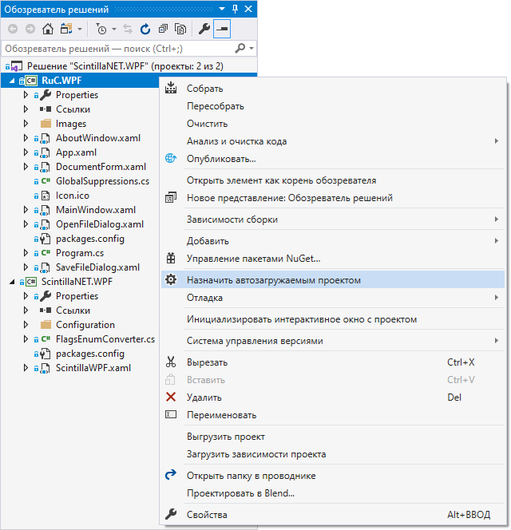

#  Russian C IDE

Данный репозиторий посвящен созданию IDE для языка [RuC](https://github.com/andrey-terekhov/RuC),
разработанного [Андреем Николаевичем Тереховым](https://github.com/andrey-terekhov)
заведующим кафедрой "Системного программирования" СПбГУ.
Кроме того, целевая среда должна иметь возможность взаимодействия с контроллером ЙоТик v2.0, компании [MGBot](https://mgbot.ru/).
Так как этот контроллер поддерживает данный язык.

Разрабатываемая среда должна обеспечивать:
- Компиляцию RuC кода
- Загрузку кода на контроллер
- Обновление ПО контроллера

За основу проекта была взята оболочка [ScintillaNET](https://github.com/jacobslusser/ScintillaNET)
с использованием Windows Presentation Foundation.

## Сборка

Для сборки достаточно открыть файл `./ScintillaNET.WPF.sln`
в [Visual Studio](https://visualstudio.microsoft.com/ru/vs/)
и назначить `RuC.WPF` автозагружаемым проектом, после чего можно начать сборку.

#### P.s. Предпочтительнее собирать Release версию.
